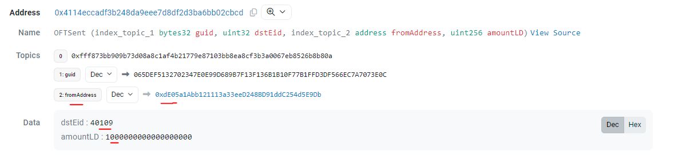

# Contingency (Proposed)

- Off-chain monitoring of tokens bridged. Could potentially use Tenderly.
- Disconnect bridge when source chain emits malicious/incorrect LzSend event
- What happens to the tokens on the src when you d/c the dst, after firing off on the src?
--> txn fails on dst. But it could potentially be re-tried.

## Off-chain monitoring

### Identifying a malicious txn

Mints more than it burns/locks. We can assess this by observing 2 parts:

1. how much tokens did the address transfer to the OFT
2. how much tokens are going to be minted as laid out by the lzReceive event emitted

The first reflects how much the address actually ponies up, while the latter reflects new issue of tokens.

If deemed incorrect, we can opt to simply reject this message by clearing it. This prevents the malicious packet from being executed on dstChain, while all other messages are well received.

> https://docs.layerzero.network/contracts/debugging-messages#clearing-message

Once a payload is cleared, it cannot be recovered. There are no retries.
Of course, the attacker can simply repeat with a new transaction, but he'd be paying gas again.

**Are there other metrics by which we can identify a malicious txn?**

### Alternative Measure: Pausing all contracts

- We can pause all contracts, across all chains.
- This includes x-chain messaging as well as token transfers
- Essentially, we freeze all contracts.

When is this measure sensible?

- Possibly when a breach of totalSupply has occurred. It is necessary to freeze everything and investigate.
- Important that token transfers cannot occur, to avoid obfuscating evidence.

### Alternative Measure: Breaking Bridges

We can disconnect the connection between contracts by resetting `setPeers`.

For example, when an incorrect lz event is emitted on the src chain, we look to disconnect the bridge by calling `setPeers` on the dst chain. By breaking the connection between chains, on the dst chain we can essentially front-run the LZ relay and prevent a malicious mint.

**It is important to note that the end result of creating this blockage is that tokens will be lost on the src chain.**

Obviously, since the event is emitted on the src chain, nothing much can be done there.

When is this measure sensible?

- The attack consistently originates from a specific chain
- This could be on part due to faulty LZ messaging/validation in that specific part of the network
- Meaning, the attack cannot be reproduced elsewhere.

## Tracking general health

Have a secondary script track global token balances on all chains, ensuring they add up to the correct total supply. When this value is breached, pause all contracts everywhere.

Implementing this solution requires a db of all the addresses with MocaTokens across all chains. A script will conduct an accounting check, each time a `send` event is emitted, like so:

1. Verify that the user does indeed have the sufficient tokens on src chain for the bridging event.
2. Verify that the params passed in the event are accurate
3. Verify that the event emitted on dst and tokens minted are accurate.

Remediation:

- If step 2 fails, disconnect connection btw src and dst, on dst chain.
- If step 3 fails, pause bridging everywhere.

> Consider: https://forta.org/

## Remediation ?

Unknown. Successful resolution may not be possible, particularly in extreme circumstances.

In minor one-off instances, where the value lost through attack or bugged execution, the treasury could step-in and buy up that supply or cover user losses.