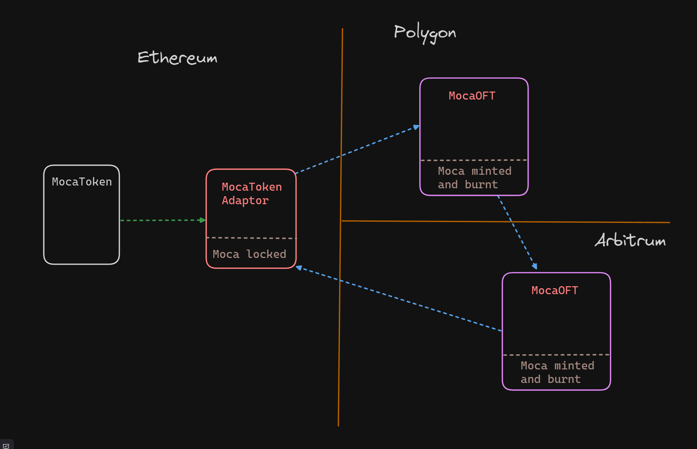
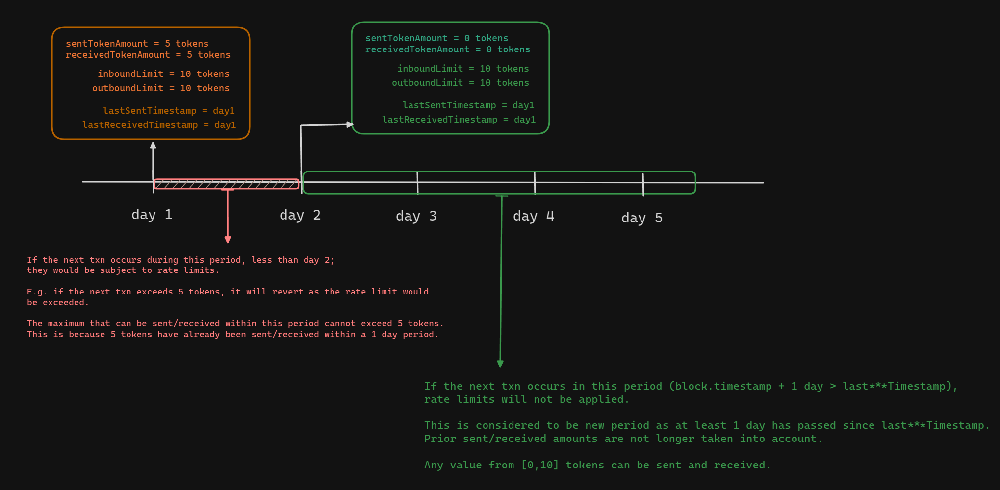

# Setup

- forge install
- npm install

# Background

MocaToken is an omni-chain token, powered by LayerZero V2. It utilises the latest OFT standard and Endpoints as per the V2 iteration of the protocol.

MocaToken is not natively deployed through LayerZero, instead it is primarily deployed as a standalone ERC20 contract, following which integrated with LayerZero via the TokenAdaptor contract.
This token adaptor contract sits on the same chain as the deployed token contract (we refer to this as the home chain), and serves as a lockbox.

Essentially, users will have to lock their moca tokens on the home chain, by transferring it to the token adaptor contract, following which bridging can place. This is known as lock and mint.
> Please see: https://docs.layerzero.network/contracts/oft-adapter

On all other chains (remote chains), the MocaOFT contract is deployed. The OFT contract offers both ERC20 and LZ functionality.

Thus for a user to bridge when on the home chain, they would:

1. Grant approval for the Adaptor contract to spent the required amount of tokens
2. Call `send` on the Adaptor contract, supplying the input parameters specifying dstChain, amount to bridge, etc

In short, the core contracts are:

- MocaToken.sol 
- MocaTokenAdaptor.sol 
- MocaOFT.sol

The first two will be deployed on Ethereum, while the last one will be deployed on every other remote chain.

## Why do we opt to use the TokenAdaptor contract?

We felt that having the adaptor would be a useful security bulwark in case of an unexpected event, since it would be limited by approvals set and the liquidity at risk would be purely the tokens locked in it.
In a way, defense in depth.

## Signatures and Permit

1. EIP2621 is broken: https://www.trust-security.xyz/post/permission-denied
2. We want to still offer similar functionality for our users.
3. Solution: EIP3009

EIP3009 has been successfully used by Circle, in its USDC implementation since v1. This offers us a degree of confidence.

To that end both MocaToken and MocaOFT contracts implemented the following functions:

- `transferWithAuthorization`
- `cancelAuthorization`
- `receiveWithAuthorization`

The primary difference between `transferWithAuthorization` and `receiveWithAuthorization` is that the latter function is called by the beneficiary of funds, providing a valid signature that was originally signed by the sender.
Both EOA and Smart contract signatures (EIP1271) are supported.

>Note that neither `increaseAllowance` nor `decreaseAllowance ` were implemented

## MocaToken Contract

- name = Moca
- symbol = MOCA
- dp = 18
- totalSupply = 8,888,888,888 ether

Total supply will be minted to the specified treasury address on deployment.

- Contract is neither upgradable nor is it pausable.
- Contract has no owner.
- It does not have a callable mint function.

It does have a standard `burn` function - msg.sender can burn his own assets. Nothing more.

## MocaTokenAdaptor Contract

Since we have opted to not natively deploy the token with LZ, the MocaTokenAdaptor contract will have to be deployed on the home chain alongside the MocaToken contract.

> See: https://docs.layerzero.network/contracts/oft-adapter

**For x-chain bridging, it is necessary to approve the OFT Adapter as a spender of your ERC20 token.**

## MocaOFT Contract

This contract will be deployed on all other remote chains, serving as a touchpoint for bridging. An execution example would be like so:

- Token is locked on home chain by MocaTokenAdaptor
- X-Chain message sent via LZ off-chain network
- MocaOFT contract on destination chain receives this message and mint the user address the appropriate amount of tokens.

Please see testnet deployments as a practical reference.

## Rate limits

Both MocaOFT and MocaTokenAdaptor implement daily rate limits.

- Rate limits are set pairwise between two chains: srcChain and dstChain. They are not global limits. 
- Rate limits are not applicable to whitelist addresses. 
- Rate limits operate as 1-day epoch limits. 
- Only the owner can set rate limits.

Putting in place x-chain transfer limits essentially allows us to limit the capital at risk due an exploit arising from an unknown LZ vulnerability.

## Testnet Deployments

V1: Deploy.s.sol

- MocaToken: https://sepolia.etherscan.io/address/0xFe149349285995D59Ec3FD6A5080840443906B45
- MocaTokenAdaptor: https://sepolia.etherscan.io/address/0xa8F355AE124d7120dAEA13239b6cC89FB0376779
- MocaOFT: https://mumbai.polygonscan.com/address/0x0EB26b982341c37A02812738C6c10EB0b66ef4F7

V2: DeployMock.s.sol (has unrestricted mint function)

- MocaTokenMock: https://sepolia.etherscan.io/address/0xE93f35988731A11280032FD8B7338B1ac3f52729
- MocaTokenAdaptor: https://sepolia.etherscan.io/address/0xb440A7367DfEB307Cb2E7e3Cb80625157126A5CA
- MocaOFT: https://mumbai.polygonscan.com/address/0xE415dCa40E5587AF6DeC72683a55ebEbA911Ba6e

Please feel free to use V2 to make your own testnet transactions - the MocaToken contract in this deployment batch has an unrestricted public mint function.
V1 does not, and is meant to reflect how an actual deployment would be.

# Front-end Integration

## Crafting signatures

Looking at the test file MocaTokenTest.t.sol will give a clearer picture on the execution process, with respect to integration.

Note that DummyContractWallet.sol serves as an example of a smart contract wallet as part of testing support for EIP1271.
It's implementation of `isValidSignature` should be referenced.

If a smart contract wallet implements `isValidSignature` differently, the signature verification will fail.

## Crafting LZ params

Looking at Deploy.s.sol, contract `SendTokensToAway` will give you an idea what params need to be crafted before calling `mocaTokenAdaptor.send` to bridge.
Essentially its a 2-step process,

1. Call `mocaTokenAdaptor.quoteSend(sendParam, false)`
2. Call `mocaTokenAdaptor.send(.....)`

The first calls the layerZero endpoint contract on the same chain to get a gas cost quote for the specified bridging action. This value (or slightly more) must be passed as `msg.value` as part of the 2nd call.

As part of the deployment process I have enforced that users to pay a minimum of 200000 wei on the source chain. This is because a standard `lzReceive` call and token transfer on the destination chain should add up to be about that much on most EVM chains.

**For more details:**

- [OFT: Estimating-gas-fees](https://docs.layerzero.network/contracts/oft#estimating-gas-fees)
- [OFT: Calling-send](https://docs.layerzero.network/contracts/oft#calling-send)

- [Message Execution Options](https://docs.layerzero.network/contracts/options)
- [Estimating Gas Fees](https://docs.layerzero.network/contracts/estimating-gas-fees)
- [Transaction Pricing](https://docs.layerzero.network/contracts/transaction-pricing)

The DevTools repo is especially useful for reference examples:

- [devtools](https://github.com/LayerZero-Labs/devtools/?tab=readme-ov-file#bootstrapping-an-example-cross-chain-project)

## Priviledged Functions

Both MocaTokenAdaptor and MocaOFT inherit Ownable and Ownable2Step. The owner address must be specified upon deployment.

Beside the owner, the other available privileged roles are:

- Operator
- Delegate (from LZ)

The operator is introduced by us and serves a singular purpose - calling resetPeer during a moment of crisis.

Owner can execute the following functions:

- setPeer
- setDelegate
- setOutboundLimit
- setInboundLimit
- setWhitelist
- setOperator

### setPeer

Provides the ability to connect two OFT contract across different chains or break the bridge. The owner can connect and disconnect.

### setDelegate

Provides the ability for a delegate to set configs, on behalf of the OApp, directly on the Endpoint contract. This involves changing enforced options wrt to gas limits and msg.value.
Additionally, delegates can instruct the OFT contracts to burn(clear), to retry certain messages which have failed. A monitoring script that aims to negate malicious messages would have to be operated by a delegate address.

> Please see: https://docs.layerzero.network/contracts/debugging-messages 

### setOutboundLimit and setInboundLimit

Allows setting of incoming and outgoing rate limits with respect to x-chain token transfers. Limits are not global, and are set on a per chain basis.

### setWhitelist

Owner to set whitelist and revoke addresses - rate limits do not apply to these addresses.

### setOperator

Owner to set and revoke operator addresses - these addresses can call resetPeer, to disconnect bridging between contracts.

### resetPeer

Resets the peer address (OApp instance) for a corresponding endpoint. Callable by owner or operator. 

### resetReceivedTokenAmount

Resets the accrued received amount for specified chain. If the rate limit has been hit for a specific epoch, owner can call this function to reset the prior cumulative received amount, to allow receivals to continue uninterrupted. 

Useful to reset, instead of having to increase and decrease limits.

### resetSentTokenAmount

Resets the accrued sent amount for specified chain. If the rate limit has been hit for a specific epoch, owner can call this function to reset the prior cumulative sent amount, to allow sending to continue uninterrupted. 

Useful to reset, instead of having to increase and decrease limits.

## Wallets

As mentioned above, an operator can call the function resetPeers to break or build a connection between two x-chain contracts. The delegate can block and clear potentially malicious messages.

Both these roles would be useful from a risk monitoring and management standpoint as they can either terminate a specific message or the entire connection during an emergency.

To that end, these addresses would have to be paired with an off-chain script that serves as a monitoring solution, sending in a timely transaction to disconnect bridging or reject a specific message. They cannot be multi-sigs addresses, as that would result in a delayed reaction.

Can use Tenderly as a safe execution environment for these private-key enabled scripts. Additionally, for extra redundancy, can have an AWS script.

The owner address however should be a multi-sig, as it has the ability to:

- change whitelisted addresses
- change rate limits
- add/remove operators/delegates

This should be a carefully considered and implemented process, which makes sense for a multi-sig -  a 2 out 3 should suffice. We can use gnosis safe.